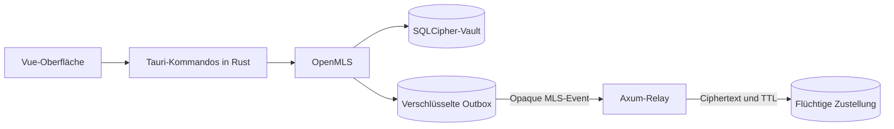

<p align="center">
	
</p>

<h1 align="center">Singularis</h1>

<p align="center">
	Eine sicherheitsorientierte, local-first Kommunikationsplattform mit
	Ende-zu-Ende-Verschlüsselung und kurzlebiger Serverhaltung.
</p>

<p align="center">
	<a href="#projektstatus"></a>
	
	
	<a href="LICENSE"></a>
</p>

## Warum Singularis?

Singularis untersucht, wie sich die vertraute Bedienung eines Community-Messengers
mit einem überprüfbaren Datenlebenszyklus verbinden lässt. Nachrichten werden auf
dem Endgerät verschlüsselt, vom Server nur zeitlich begrenzt als Ciphertext
vermittelt und auf vertrauenswürdigen Geräten in einem verschlüsselten lokalen
Archiv gespeichert.

Die Leitidee lautet:

> **Verschlüsselt senden, kurzzeitig vermitteln, kontrolliert lokal archivieren.**

Singularis setzt dabei auf etablierte Bausteine statt selbst entwickelte
Kryptographie:

- **RFC-9420-konforme MLS-Gruppenverschlüsselung** mit OpenMLS
- **Lokaler SQLCipher-Vault** für ein verschlüsseltes, durchsuchbares Archiv
- **Crash-sichere Offline-Outbox**, die Nachrichten und MLS-Zustand atomar speichert
- **Serverseitige TTL** von höchstens sieben Tagen für vermittelte Inhalte
- **Self-Hosting als Kernprinzip** ohne verpflichtenden proprietären Cloud-Dienst
- **Ehrliche Sicherheitsgrenzen** statt nicht überprüfbarer Datenschutzversprechen

Die ausführliche Produktidee, das Bedrohungsmodell und die geplante Architektur
stehen in [Singularis.md](Singularis.md).

## Projektstatus

> [!WARNING]
> Singularis ist ein früher Entwicklungsprototyp und wurde noch nicht unabhängig
> sicherheitsgeprüft. Verwende ihn nicht für produktive oder besonders sensible
> Kommunikation.

### Bereits implementiert

- Tauri-Desktopoberfläche mit Vue 3 und TypeScript
- Initialisieren, Entsperren und schnelles Sperren des lokalen Vaults
- SQLCipher-geschütztes Nachrichtenarchiv mit FTS5-Suche
- MLS-verschlüsselte Kanalnachrichten und persistenter verschlüsselter Outbox
- Wiederaufnahme ausstehender Übertragungen nach Neustart oder Netzfehler
- Axum-Relay mit Größenlimits, Idempotenz, Replay-Schutz und begrenzter TTL
- RAM-basierte Browser-Vorschau ohne dauerhafte lokale Nachrichtenablage
- Automatisierte Tests für Neustart, Manipulation, Replay, Migration und Ablauf

### Noch nicht produktionsreif

- Multi-User- und Multi-Device-Provisionierung sowie eingehende Synchronisierung
- Vollständige Konten-, Rollen-, Einladungs- und Recovery-Abläufe
- Dateiübertragung sowie echte Sprach- und Videoübertragung
- Mobile Clients, Föderation und gehärtete Self-Hosting-Pakete
- Signierte Releases, automatischer Updatepfad und unabhängiges Sicherheitsaudit

Die Oberfläche enthält bereits Interaktionsentwürfe für spätere Funktionen. Diese
sind nicht automatisch mit einem vollständigen Backend oder Medienpfad verbunden.

## Aktueller Sendepfad



Der Relay erhält das verschlüsselte MLS-Payload und die für Routing, Reihenfolge
und Ablauf notwendigen Metadaten, aber keinen Nachrichtenklartext. Im aktuellen
Desktop-Prototyp werden Kanäle lokal für einen einzelnen Teilnehmer initialisiert;
die sichere Aufnahme weiterer Geräte und Mitglieder ist noch in Arbeit.

## Schnellstart

### Voraussetzungen

- [Git](https://git-scm.com/)
- [Rust](https://rustup.rs/) 1.85.1 mit Cargo, Clippy und Rustfmt
- [Node.js](https://nodejs.org/) 20.19 oder neuer sowie npm
- Systemabhängigkeiten für [Tauri 2](https://v2.tauri.app/start/prerequisites/)

Der native Prototyp wird derzeit unter Linux entwickelt und benötigt dort unter
anderem GTK 3 und WebKitGTK 4.1. Die Browser-Vorschau kann ohne Tauri gestartet
werden.

### Repository vorbereiten

```sh
git clone https://github.com/DNSx64/Singularis.git
cd Singularis
npm install
```

### Browser-Vorschau starten

```sh
npm run dev
```

Vite zeigt anschließend die lokale URL im Terminal an. Die Browser-Vorschau hält
Nachrichten nur im Arbeitsspeicher und bildet weder den nativen SQLCipher-Vault
noch eine vollständige MLS-Relay-Zustellung ab.

### Nativen Prototyp starten

Starte den lokalen Relay-Server in einem Terminal:

```sh
cargo run -p singularis-server
```

Starte danach die Tauri-Anwendung in einem zweiten Terminal:

```sh
npm run tauri --workspace @singularis/desktop -- dev
```

Die lokalen Standardadressen und konfigurierbaren Umgebungsvariablen stehen in
[env.example](env.example). Der Server bindet standardmäßig nur an
`127.0.0.1:8787`.

## Qualität prüfen

Vor einem Pull Request sollten alle Prüfungen erfolgreich sein:

```sh
cargo fmt --all -- --check
cargo clippy --workspace --all-targets -- -D warnings
cargo test --workspace --all-targets
npm run typecheck
npm run build
```

Der wichtigste Ende-zu-Ende-Test deckt den verschlüsselten Outbox-Ablauf über
Absturz, Neustart, Relay-Wiederholung, Empfang und Bestätigung ab:

```sh
cargo test -p singularis-server queued_mls_event_survives_restart_and_relay_retry -- --nocapture
```

Details dazu enthält die
[Dokumentation des verschlüsselten Outbox-Flows](docs/testing/first-encrypted-outbox-flow.md).

## Repository-Struktur

| Pfad | Aufgabe |
|---|---|
| [`apps/desktop`](apps/desktop) | Vue-/TypeScript-Oberfläche und native Tauri-Anwendung |
| [`crates/singularis-protocol`](crates/singularis-protocol) | Gemeinsame Event-, TTL- und Wire-Verträge |
| [`crates/singularis-mls`](crates/singularis-mls) | MLS-Client, verschlüsselte Events und Zustandsübergänge |
| [`crates/singularis-vault`](crates/singularis-vault) | Lokaler SQLCipher-Vault, Suche, Migration und Outbox |
| [`crates/singularis-server`](crates/singularis-server) | Flüchtiger Axum-Relay und HTTP-API |
| [`docs`](docs) | Architekturentscheidungen und Testdokumentation |

Wichtige Architekturentscheidungen:

- [ADR 0001: MLS-Bibliothek und Plattformunterstützung](docs/adr/0001-mls-library-and-platform-support.md)
- [ADR 0004: SQLCipher-Paketierung und Schlüsselablage](docs/adr/0004-sqlcipher-packaging-and-key-storage.md)

## Sicherheitsgrenzen

Singularis reduziert unnötig gespeicherte Inhalte, kann aber nicht jede Form der
Beobachtung oder Kopie verhindern:

- Ende-zu-Ende-Verschlüsselung verbirgt nicht sämtliche Verbindungsmetadaten.
- Ein kompromittiertes, entsperrtes Endgerät kann Klartext offenlegen.
- Empfänger können zugestellte Inhalte kopieren oder aufnehmen.
- Ablauf auf dem Server bedeutet nicht Löschung auf fremden Endgeräten.
- Verfügbarkeit und korrekte Zustellung bleiben vom Relay-Server abhängig.

Das vollständige Bedrohungsmodell und die bewusst ausgeschlossenen Garantien sind
Teil der [Projektspezifikation](Singularis.md).

## Mitwirken

Fehlerberichte, Architekturfeedback und fokussierte Pull Requests sind willkommen.
Bitte prüfe vor größeren Änderungen die vorhandenen
[Issues](https://github.com/DNSx64/Singularis/issues) und beschreibe bei
sicherheitsrelevanten Änderungen das angenommene Bedrohungsmodell sowie die
zugehörigen Tests.

## Lizenz

Singularis wird unter der [GNU General Public License Version 3](LICENSE)
veröffentlicht.