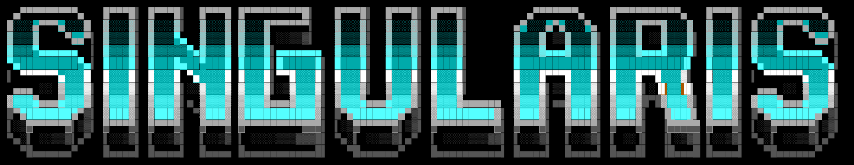
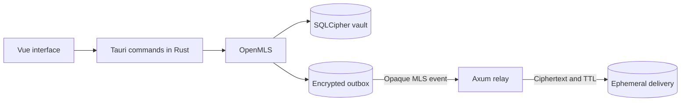

<p align="center">
	
</p>

<h1 align="center">Singularis</h1>

<p align="center">
	A security-focused, local-first communication platform with end-to-end
	encryption and short-lived server retention.
</p>

<p align="center">
	<a href="#project-status"></a>
	
	
	<a href="LICENSE"></a>
</p>

## Why Singularis?

Singularis explores how the familiar experience of a community messenger can be
combined with a verifiable data lifecycle. Messages are encrypted on the device,
relayed by the server as ciphertext for a limited time, and stored in an encrypted
local archive on trusted devices.

The guiding principle is:

> **Send encrypted, relay briefly, archive locally under your control.**

Singularis relies on established building blocks instead of custom cryptography:

- **RFC 9420-compliant MLS group encryption** powered by OpenMLS
- **A local SQLCipher vault** for an encrypted, searchable archive
- **A crash-resilient offline outbox** that atomically stores messages and MLS state
- **A server-side TTL** of no more than seven days for relayed content
- **Self-hosting as a core principle** with no mandatory proprietary cloud service
- **Honest security boundaries** instead of unverifiable privacy promises

The complete product concept, threat model, and planned architecture are documented
in [Singularis.md](Singularis.md), which is currently available in German.

Practical self-hosting and operations notes live in [docs/wiki/Home.md](docs/wiki/Home.md).

## Project status

> [!WARNING]
> Singularis is an early development prototype and has not undergone an independent
> security audit. Do not use it for production or highly sensitive communication.

### Implemented today

- Tauri desktop interface built with Vue 3 and TypeScript
- Initialization, unlocking, and quick locking of the local vault
- SQLCipher-protected message archive with FTS5 search
- MLS-encrypted channel messages and a persistent encrypted outbox
- Recovery of pending deliveries after a restart or network failure
- Axum relay with size limits, idempotency, replay protection, and a bounded TTL
- RAM-only browser preview with no persistent local message storage
- Automated tests for restart, tampering, replay, migration, and expiration behavior

### Not production-ready yet

- Multi-user and multi-device provisioning, including incoming synchronization
- Complete account, role, invitation, and recovery workflows
- File transfer and real voice or video transport
- Mobile clients, federation, and hardened self-hosting packages
- Signed releases, an automatic update path, and an independent security audit

The interface already contains interaction designs for future features. Their
presence does not imply that a complete backend or media path is implemented.

## Current message path



The relay receives the encrypted MLS payload and the metadata required for routing,
ordering, and expiration, but no message plaintext. In the current desktop
prototype, channels are initialized locally for a single participant. Securely
adding more devices and members is still in development.

## Quick start

### Prerequisites

- [Git](https://git-scm.com/)
- [Rust](https://rustup.rs/) 1.85.1 with Cargo, Clippy, and Rustfmt
- [Node.js](https://nodejs.org/) 20.19 or newer with npm
- Platform-specific dependencies for [Tauri 2](https://v2.tauri.app/start/prerequisites/)

The native prototype is currently developed on Linux, where it requires GTK 3 and
WebKitGTK 4.1 among other system packages. The browser preview can be started
without Tauri.

### Prepare the repository

```sh
git clone https://github.com/DNSx64/Singularis.git
cd Singularis
npm install
```

### Start the browser preview

```sh
npm run dev
```

Vite prints the local URL in the terminal. The browser preview keeps messages in
memory only and does not reproduce the native SQLCipher vault or a complete MLS
relay delivery.

### Start the native prototype

Start the local relay server in one terminal:

```sh
cargo run -p singularis-server
```

Then start the Tauri application in a second terminal:

```sh
npm run tauri --workspace @singularis/desktop -- dev
```

Local defaults and configurable environment variables are listed in
[env.example](env.example). By default, the server binds only to
`127.0.0.1:8787`.

## Quality checks

Before opening a pull request, all checks should pass:

```sh
cargo fmt --all -- --check
cargo clippy --workspace --all-targets -- -D warnings
cargo test --workspace --all-targets
npm run typecheck
npm run build
```

The primary end-to-end test covers the encrypted outbox flow across a crash,
restart, relay retry, reception, and acknowledgement:

```sh
cargo test -p singularis-server queued_mls_event_survives_restart_and_relay_retry -- --nocapture
```

See the [encrypted outbox flow documentation](docs/testing/first-encrypted-outbox-flow.md)
for details.

## Repository layout

| Path | Purpose |
|---|---|
| [`apps/desktop`](apps/desktop) | Vue/TypeScript interface and native Tauri application |
| [`crates/singularis-protocol`](crates/singularis-protocol) | Shared event, TTL, and wire contracts |
| [`crates/singularis-mls`](crates/singularis-mls) | MLS client, encrypted events, and state transitions |
| [`crates/singularis-vault`](crates/singularis-vault) | Local SQLCipher vault, search, migration, and outbox |
| [`crates/singularis-server`](crates/singularis-server) | Ephemeral Axum relay and HTTP API |
| [`docs`](docs) | Architecture decisions and test documentation |

Key architecture decisions:

- [ADR 0001: MLS library and platform support](docs/adr/0001-mls-library-and-platform-support.md)
- [ADR 0004: SQLCipher packaging and key storage](docs/adr/0004-sqlcipher-packaging-and-key-storage.md)

## Security boundaries

Singularis reduces unnecessary content retention, but it cannot prevent every form
of observation or copying:

- End-to-end encryption does not hide all connection metadata.
- A compromised, unlocked device can expose plaintext.
- Recipients can copy or record delivered content.
- Expiration on the server does not delete content from other devices.
- Availability and correct delivery still depend on the relay server.

The complete threat model and explicitly excluded guarantees are part of the
[project specification](Singularis.md).

## Contributing

Bug reports, architecture feedback, and focused pull requests are welcome. Before
starting a larger change, please review the existing
[issues](https://github.com/DNSx64/Singularis/issues). For security-related changes,
describe the assumed threat model and the tests that cover it.

## License

Singularis is released under the [GNU General Public License Version 3](LICENSE).