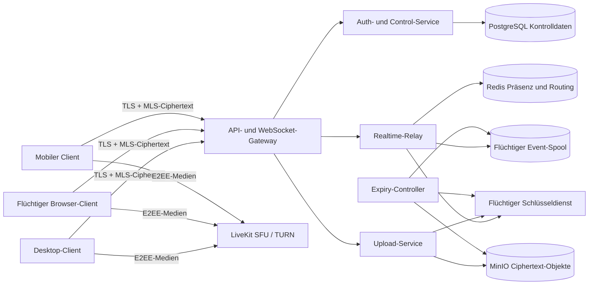

# Project Singularis

## Sicherheitsorientierte, local-first Kommunikationsplattform mit flüchtiger Serverhaltung

> **Konzeptstand:** 0.2, August 2026 
> **Status:** Produkt- und Architekturentwurf, noch keine Sicherheitsfreigabe

---

## 1. Kurzfassung

**Singularis** ist eine selbst hostbare Kommunikationsplattform für Text, Dateien, Sprache und Video. Die Bedienung orientiert sich an etablierten Community-Messengern, das Datenmodell jedoch nicht: Inhalte werden auf dem Endgerät verschlüsselt, vom Server nur zeitlich begrenzt als Ciphertext vermittelt und auf vertrauenswürdigen Geräten in einem verschlüsselten lokalen Archiv gespeichert.

Der Server ist damit kein dauerhaftes Nachrichtenarchiv, sondern besteht aus zwei klar getrennten Bereichen:

1. einer **dauerhaften Kontrollebene** für Konten, Geräte, Communities, Rollen und Kanalstrukturen;
2. einer **flüchtigen Inhaltsebene** für Ende-zu-Ende-verschlüsselte Nachrichten und Medien mit maximal sieben Tagen Verfügbarkeit.

Singularis verspricht keine magische Spurlosigkeit. Empfänger können Inhalte kopieren, kompromittierte Endgeräte können Klartext offenlegen und Netzwerkbetreiber können Verbindungsmetadaten beobachten. Das Produkt macht diese Grenzen sichtbar, minimiert unnötige Daten und vermeidet Sicherheitszusagen, die technisch nicht überprüfbar wären.

---

## 2. Produktversprechen

Singularis basiert auf sechs verbindlichen Zusagen:

1. **Inhalte sind standardmäßig Ende-zu-Ende verschlüsselt.** Der Betreiber kann reguläre Nachrichten, Anhänge sowie Sprach- und Videoinhalte nicht im Klartext lesen.
2. **Serverkopien von Inhalten sind kurzlebig.** Eine Instanz darf für Nachrichten und Medien höchstens sieben Tage Verfügbarkeit konfigurieren; Kanäle können nur kürzere Fristen wählen.
3. **Das Desktop-Archiv gehört dem Nutzer.** Empfangene Inhalte können lokal, verschlüsselt, offline verfügbar und durchsuchbar bleiben, solange die gewählte Aufbewahrungsregel dies erlaubt.
4. **Der Browser ist ein flüchtiger Client.** Nachrichteninhalte und Schlüssel werden nicht absichtlich dauerhaft im Browser gespeichert. Vollständige Spurlosigkeit gegenüber Betriebssystem, Browser, Erweiterungen oder Bildschirmaufnahmen wird nicht behauptet.
5. **Der Kern bleibt unabhängig betreibbar.** Protokoll, Server und Kernclients sollen offen dokumentiert, auditierbar und ohne verpflichtende proprietäre Cloud-Dienste nutzbar sein.
6. **Sicherheitszustände sind verständlich sichtbar.** Verschlüsselung, Serverablauf, lokale Archivierung, Gerätestatus und fehlende Historie dürfen nicht hinter abstrakten Einstellungen verschwinden.

### 2.1 Nicht-Ziele

Singularis ist in der ersten Produktphase ausdrücklich nicht:

* ein anonymes Netzwerk wie Tor;
* ein garantiert forensikfreier Messenger;
* ein öffentliches soziales Netzwerk mit algorithmischem Feed;
* eine Plattform mit serverseitiger Volltextsuche in Nachrichten;
* ein System, das einmal zugestellte Inhalte von fremden Geräten zurückholen kann;
* von Beginn an ein vollständig föderiertes Netzwerk;
* eine Eigenentwicklung kryptographischer Primitive.

### 2.2 Zielgruppen und Kernanwendungsfälle

Singularis richtet sich primär an private Communities, Open-Source-Projekte, kleine Organisationen und selbstverwaltete Teams, die vertrauliche Kommunikation und lokale Datenhoheit höher gewichten als unbegrenzte Serverhistorie. Typische Anwendungsfälle sind langfristig lokal archivierte Gruppenchats, temporäre Projektkanäle, Dateiübergabe innerhalb einer Community und vertrauliche Sprachräume.

Für anonyme Hinweisgabe, akute Notfallkommunikation oder Szenarien mit bereits kompromittierten Endgeräten ist Singularis ohne zusätzliche Schutzmaßnahmen nicht geeignet. Organisationen mit hohem Schutzbedarf müssen ihr konkretes Bedrohungsmodell vor dem Einsatz prüfen.

---

## 3. Leitprinzipien

### 3.1 Local first, nicht local only

Das lokale Ereignisprotokoll ist für den Nutzer die langfristige Quelle seiner sichtbaren Historie. Der Server vermittelt neue Ereignisse, verwaltet Berechtigungen und überbrückt kurze Offline-Zeiten. Ein Gerät, das länger als die Server-TTL offline war, kann fehlende Inhalte nur von einem bereits synchronisierten eigenen Gerät oder aus einem verschlüsselten Export beziehen.

### 3.2 Privacy by default

Es werden nur Daten erhoben, die für Zustellung, Sicherheit oder vom Nutzer aktiv ausgelöste Funktionen erforderlich sind. Telemetrie ist standardmäßig deaktiviert. Adressbücher, Telefonnummern und Werbe-IDs sind keine Voraussetzung für ein Konto.

### 3.3 Usable security

Sichere Standardwerte müssen ohne Kryptographie-Wissen funktionieren. Kritische Aktionen wie Geräteaufnahme, Schlüsseländerung, Export und Kontowiederherstellung erhalten klare, überprüfbare Abläufe statt bloßer Warnfenster.

### 3.4 Offene Standards und Krypto-Agilität

Singularis verwendet versionierte Protokolle und etablierte, auditierte Bibliotheken. Algorithmen und Cipher Suites sind austauschbar, ohne das Datenmodell neu erfinden zu müssen. Eine selbst entworfene Gruppenverschlüsselung ist ausgeschlossen.

### 3.5 Ehrliche Grenzen

„Vom Server abgelaufen“ bedeutet nicht „bei allen Empfängern gelöscht“. „Browser flüchtig“ bedeutet nicht „vom Betriebssystem nicht beobachtbar“. „Ende-zu-Ende verschlüsselt“ bedeutet nicht „ohne Metadaten“. Diese Unterschiede werden im Produkt und in der Dokumentation konsistent benannt.

---

## 4. Begriffe und Datenlebenszyklen

### 4.1 Begriffe

* **Instanz:** Eine eigenständig betriebene Singularis-Installation.
* **Community:** Ein gemeinsamer Raum mit Mitgliedern, Rollen und Kanälen.
* **Kanal:** Eine Berechtigungs- und Verschlüsselungsdomäne innerhalb einer Community.
* **Gerät:** Eine separat autorisierte Clientinstallation mit eigenem Schlüsselmaterial.
* **Event:** Eine Nachricht, Reaktion, Bearbeitung, Löschanforderung oder Zustandsänderung.
* **Server-TTL:** Zeitraum, in dem verschlüsselter Inhalt über den Server abrufbar bleibt.
* **Lokale Aufbewahrung:** Zeitraum, in dem ein Client entschlüsselte Inhalte in seinem Vault behält.
* **Verschwindemodus:** Kooperative Regel, nach der konforme Clients Inhalte lokal frühzeitig löschen.

### 4.2 Drei unabhängige Fristen

| Ebene | Zweck | Mögliche Werte | Verbindlichkeit |
|---|---|---|---|
| Server-TTL | Offline-Zustellung von Ciphertext | 5 Minuten bis 7 Tage | Vom Server technisch erzwungen |
| Lokale Aufbewahrung | Persönliches Archiv | nicht speichern, 24 Stunden, 30 Tage, unbegrenzt | Vom jeweiligen Client erzwungen |
| Verschwindemodus | Sensible Unterhaltung | nach Öffnen oder nach kurzer Frist | Kooperativ, nicht gegen manipulierte Clients durchsetzbar |

Die Serverfrist wird bei Annahme eines Events berechnet:

$$
\text{expires\_at} = \text{accepted\_at} + \min(\text{channel\_ttl}, \text{instance\_max\_ttl})
$$

Dabei gilt zwingend:

$$
\text{instance\_max\_ttl} \leq 7\ \text{Tage}
$$

Bearbeitungen, Reaktionen und Dateiverweise dürfen die Ablaufzeit des referenzierten Ursprungsinhalts nicht verlängern. Das Anheften einer Nachricht speichert höchstens ihre ID und setzt die Inhalts-TTL nicht außer Kraft.

### 4.3 Bedeutung von „gelöscht“

Nach `expires_at` liefern APIs, WebSockets und Download-URLs den Inhalt nicht mehr aus. Löschjobs entfernen Datensätze, Replikate und Objekte; die flüchtige Inhaltsebene wird nicht in Langzeit-Backups aufgenommen. Löschbelege enthalten nur technische IDs, Zeitpunkte und Zähler, niemals Inhalte.

Eine sekundengenaue physische Überschreibung auf SSDs, Replikaten oder Dateisystem-Snapshots ist nicht seriös garantierbar. Singularis definiert daher:

* **logisches Löschen:** exakt ab `expires_at` nicht mehr abrufbar;
* **kryptographisches Löschen:** zugehöriges serverseitiges Speicherschlüsselmaterial innerhalb eines kurzen, messbaren Löschfensters unbrauchbar;
* **physische Freigabe:** nachgelagert durch Datenbank- und Objektspeicherbereinigung.

Die konkrete Löschfrist und deren Messung sind Teil der Betriebsrichtlinie jeder Instanz.

---

## 5. Bedrohungsmodell

### 5.1 Schutz gegen

* passive und aktive Angreifer im Netzwerk;
* einen neugierigen oder nachträglich kompromittierten Serverbetreiber;
* Diebstahl eines ausgeschalteten oder gesperrten Endgeräts;
* Manipulation, Wiederholung und unbemerkte Veränderung transportierter Events;
* unautorisierte Geräteaufnahme;
* versehentliche Langzeitspeicherung in Logs, Backups und Caches;
* Massenmissbrauch durch Rate Limits, Einladungen und Community-Moderation.

### 5.2 Kein vollständiger Schutz gegen

* Malware, Keylogger oder Bildschirmaufnahme auf einem entsperrten Endgerät;
* absichtliches Kopieren durch berechtigte Empfänger;
* Verkehrs- und Beziehungsanalyse anhand von Zeitpunkt, Größe und Ziel einer Verbindung;
* einen bösartigen Community-Administrator innerhalb seiner legitimen Rechte;
* einen Betreiber, der vor Ablauf absichtlich Schlüssel oder Ciphertext außerhalb des Systems kopiert;
* Dienstverweigerung, Zurückhalten oder Löschen von Nachrichten durch einen Server;
* schwache Master-Passwörter oder verlorene Wiederherstellungsdaten;
* Fehler in nicht auditierten Plattformkomponenten und System-WebViews.

### 5.3 Sichtbare Metadaten

Der Homeserver muss in der ersten Architekturversion Konten, Geräte, Community-Mitgliedschaften, Rollen, Kanal-IDs, Zustellziele, Eventgrößen und Zeitpunkte kennen. Kanalnamen und Profile sind im MVP ebenfalls serverlesbare Kontrolldaten. Nachrichteninhalte und Dateiinhalte bleiben verschlüsselt.

IP-Adressen werden für die Netzwerkverbindung zwangsläufig verarbeitet. Rohadressen werden standardmäßig nicht in Anwendungs- oder Proxy-Logs geschrieben. Temporäre Missbrauchsabwehr kann eine kurze, dokumentierte Verarbeitung erfordern; eine pauschale Zusage „der Server sieht keine IP“ wäre falsch.

---

## 6. Identitäten, Geräte und Wiederherstellung

### 6.1 Identitätsmodell

* Bei der Registrierung erzeugt der Client eine langfristige Nutzeridentität.
* Jedes Gerät besitzt eigene Signatur- und Schlüsselaustauschschlüssel.
* Ein Gerät wird durch ein vorhandenes vertrauenswürdiges Gerät oder einen Wiederherstellungsnachweis autorisiert.
* Der Identitätsschlüssel verankert das erste Gerät und den Recovery-Pfad. Aktive Geräte signieren Aufnahme- und Widerrufserklärungen für weitere Geräte; Clients prüfen die vollständige Vertrauenskette gegen den öffentlichen Identitätsschlüssel.
* Kontakte können Identitäten per QR-Code oder kurzem Sicherheitscode vergleichen.

Als Ausgangspunkt dienen Ed25519 für Signaturen und die von der gewählten MLS-Cipher-Suite vorgegebenen HPKE-Verfahren. Die endgültige Auswahl erfolgt in einem Kryptographie-ADR und nach Bibliotheksprüfung.

### 6.2 Anmeldung

Die reguläre Anmeldung kombiniert einen vom Gerät signierten Server-Challenge mit einer serverseitigen Sitzung. Für neue Geräte, administrative Konten und sensible Aktionen werden WebAuthn/Passkeys empfohlen; externe Hardware-Keys werden vollständig unterstützt.

TOTP und einmalige Recovery-Codes sind mögliche Fallbacks, aber weniger phishing-resistent als Passkeys. Ein TOTP-Code allein darf kein neues Ende-zu-Ende-Schlüsselgerät autorisieren.

### 6.3 Geräteaufnahme im MVP

1. Das neue Gerät erzeugt lokal sein Schlüsselpaar und eine einmalige Pairing-Anfrage.
2. Ein aktives Gerät scannt den QR-Code, beide Seiten vergleichen einen kurzen Authentifizierungscode und der Nutzer bestätigt die Aufnahme.
3. Das aktive Gerät signiert die neue Geräteberechtigung und erzeugt die benötigten MLS-`Welcome`-Nachrichten. Der Server vermittelt nur die signierten und verschlüsselten Pakete.
4. Bestehende Clients prüfen die Vertrauenskette und zeigen die Änderung an. Ein Widerruf entfernt das Gerät aus den Gruppen und löst neue MLS-Epochen aus.

Ohne aktives Gerät ist eine Recovery-Kapsel mit mindestens 128 Bit zufälliger Entropie erforderlich. Sie autorisiert den neuen Geräteschlüssel kryptographisch; Passkey und TOTP können die Serversitzung zusätzlich schützen, ersetzen diese Berechtigung aber nicht.

### 6.4 Wiederherstellung

Nutzer wählen beim Onboarding mindestens einen Weg:

1. Freigabe durch ein bereits angemeldetes Gerät;
2. verschlüsselter Wiederherstellungs-Export mit hochentropischem Recovery-Code;
3. manuell gesicherter Identitätsschlüssel für fortgeschrittene Nutzer.

Sind alle Geräte und Wiederherstellungsdaten verloren, kann der Server die alten Ende-zu-Ende-Schlüssel nicht rekonstruieren. Ein Identitäts-Reset erzeugt eine neue Identität und wird Kontakten sowie Communities deutlich angezeigt.

Ein Recovery-Vorgang stellt die Identität wieder her, nicht automatisch das lokale Nachrichtenarchiv. Alte Inhalte benötigen weiterhin einen Vault-Export oder einen direkten Transfer von einem eigenen Gerät.

### 6.5 Schlüsseltransparenz

Im MVP gilt beim ersten Kontakt Trust on First Use. Ein QR- oder Sicherheitscode-Vergleich hebt einen Kontakt sichtbar auf den Status „manuell verifiziert“; spätere Identitätsänderungen setzen diesen Status zurück. Vor öffentlicher Föderation ist ein append-only Schlüsseltransparenz- und Konsistenzmechanismus erforderlich, damit ein Server verschiedenen Nutzern keine unbemerkten, voneinander abweichenden Geräteansichten präsentieren kann.

---

## 7. Ende-zu-Ende-Verschlüsselung

### 7.1 Nachrichten

Gruppen- und Direktnachrichten verwenden **Messaging Layer Security (MLS, RFC 9420)** über eine gepflegte, auditierbare Implementierung. MLS liefert Gruppenmitgliedschaft, Epochenschlüssel, Forward Secrecy und Post-Compromise Security. Private Kanäle bilden getrennte MLS-Gruppen, damit ein Rollenwechsel nicht versehentlich Zugriff auf fremde Kanalhistorie gibt.

Ein MLS-`Welcome` gibt einem neu aufgenommenen Gerät nur den aktuellen Gruppenzustand und zukünftige Schlüssel, nicht frühere Epochenschlüssel oder alte Nachrichten. Singularis hinterlegt keine Historien- oder Exporter-Schlüssel beim Server. Vergangene Inhalte gelangen ausschließlich durch einen bewusst gestarteten, Ende-zu-Ende-verschlüsselten Vault- oder Gerätetransfer auf ein neues Gerät.

Jedes Event enthält innerhalb des verschlüsselten Payloads mindestens:

* eine zufällige Event-ID;
* Absendergerät, Client-Zeitstempel und monotonen Absenderzähler;
* den Hash des vorherigen Events dieses Absendergeräts im Kanal;
* Eventtyp und Schema-Version;
* Referenzen auf Antwort, Bearbeitung oder Löschung;
* Inhalt und optional ein verschlüsseltes Medienmanifest.

Der Server ergänzt außerhalb des Payloads nur die für Routing, Berechtigung, Größenlimits, Reihenfolge und TTL notwendigen Felder. Clients prüfen MLS-Epoche, Mitgliedschaft, Event-ID und Replay-Schutz.

### 7.2 Anhänge

Anhänge werden vor dem Upload lokal mit einem zufälligen Medienschlüssel und chunkbasierter authentifizierter Verschlüsselung verschlüsselt. Der Objektspeicher erhält ausschließlich Ciphertext. Schlüssel, Dateiname, MIME-Typ, Prüfsumme und Vorschaumetadaten liegen im MLS-verschlüsselten Nachrichtenpayload.

Vorschauen werden auf dem Client erzeugt und ebenfalls verschlüsselt. Download-URLs sind kurzlebig und an berechtigte Sitzungen gebunden. Die Objekt-TTL darf niemals länger als die zugehörige Nachrichten-TTL sein.

### 7.3 Transport

Zusätzlich zur E2EE verwenden alle Client-, Server- und Föderationsverbindungen TLS 1.3. HTTPS dient Kontroll-APIs und Uploads; WebSockets übertragen Echtzeitereignisse. Transportverschlüsselung ersetzt nicht die Ende-zu-Ende-Verschlüsselung.

### 7.4 Kryptographische Regeln

* Keine selbst entwickelten Primitive oder Ad-hoc-Protokolle.
* Schlüssel und Nonces werden ausschließlich über kryptographisch sichere Zufallsquellen erzeugt.
* Protokollversion und Cipher Suite werden explizit ausgehandelt.
* Unsichere Versionen können instanzweit gesperrt werden.
* Testvektoren, Interoperabilitätstests und Fuzzing sind Release-Voraussetzungen.
* Schlüssel werden im Speicher so kurz wie praktikabel gehalten und beim Sperren bestmöglich verworfen; vollständige RAM-Spurlosigkeit wird nicht garantiert.

---

## 8. Datenklassen und Aufbewahrung

| Datenklasse | Beispiele | Server im Klartext | Standard-Aufbewahrung |
|---|---|---:|---|
| Kontrolldaten | Konto-ID, Geräte, Communities, Rollen, Kanäle | ja | bis Löschung oder Austritt, Backups zeitlich begrenzt |
| Profildaten | Anzeigename, Avatar, Status | im MVP ja | bis Änderung oder Kontolöschung |
| Inhalts-Spool | Nachrichten- und Reaktionsciphertext | nein | Kanal-TTL, maximal 7 Tage |
| Medien-Spool | verschlüsselte Dateien und Vorschauen | nein | höchstens Nachrichten-TTL |
| Präsenz | online, tippt, Sprachraum | ja | Sekunden bis wenige Minuten |
| Betriebsdaten | Request-ID, Fehlerklasse, Metriken | teilweise | standardmäßig 24 Stunden, ohne Inhalte |
| Missbrauchsmeldung | bewusst ausgewählte Inhalte und Kontext | nein; nur ausgewählte Moderatoren | transparent konfiguriert, z. B. 90 Tage |
| Lokaler Vault | Historie, Suche, Einstellungen, Medien | nein | Nutzerregel oder kooperative Kanalrichtlinie |

Die flüchtige Inhaltsebene ist von Backups der Kontrollebene ausgeschlossen. Support-Dumps, Traces und Fehlermeldungen dürfen weder Payloads noch Schlüssel, Tokens, Download-URLs oder ungekürzte vertrauliche Header enthalten.

---

## 9. Referenzarchitektur

### 9.1 Client

Der Client besteht aus einer gemeinsamen Rust-Kernbibliothek für Kryptographie, Protokoll, Vault, Sync und Medienverschlüsselung sowie einer getrennten Oberfläche. Sicherheitskritische Funktionen bleiben außerhalb des JavaScript-Kontexts. Tauri-Berechtigungen werden minimal freigeschaltet; Dateisystem-, Shell- und Netzwerkzugriffe folgen einer expliziten Allowlist.

### 9.2 Kontrollebene

Die dauerhafte Kontrollebene verwaltet:

* Konten und öffentliche Schlüssel;
* autorisierte Geräte und Key Packages;
* Communities, Kanäle, Rollen und Mitgliedschaften;
* Einladungen, Sperren und Ratelimit-Zustände;
* Instanzrichtlinien und Ablaufgrenzen;
* keine regulären Nachrichteninhalte.

### 9.3 Flüchtige Inhaltsebene

Ein separater Event-Spool speichert verschlüsselte Umschläge mit `expires_at`. Der bereits Ende-zu-Ende-verschlüsselte Inhalt erhält zusätzlich eine äußere Speicherverschlüsselung mit einem kurzlebigen, objektbezogenen Datenschlüssel. Dieser Schlüssel kann nur die äußere Schicht öffnen und gibt dem Server keinen Zugriff auf den eigentlichen Klartext; seine Vernichtung ermöglicht jedoch überprüfbares kryptographisches Löschen der Serverkopie.

Das Referenzmodell verwendet einen getrennten PostgreSQL-Cluster mit unveränderlichen Spalten `accepted_at` und `expires_at`, einer Datenbank-Constraint von höchstens sieben Tagen sowie nach Ablaufzeit partitionierten Tabellen. Jede Leseoperation prüft die Frist erneut gegen die Serverzeit. Unsichere Zeitabweichungen versetzen Annahme und Auslieferung in einen geschützten Fehlerzustand, statt Laufzeiten still zu verlängern.

Der objektbezogene Datenschlüssel wird mit einem minutengenau ablaufenden Bucket-Schlüssel umhüllt. Diese Bucket-Schlüssel existieren ausschließlich in einem kleinen, gegen Swap und Core-Dumps gehärteten RAM-Schlüsseldienst und werden nur zwischen laufenden Replikaten übertragen. Sie werden niemals in Datenbank, WAL, Snapshot oder Backup geschrieben. Fällt der gesamte Schlüsseldienst aus, sind noch wartende Inhalte absichtlich nicht wiederherstellbar. Das ist ein Verfügbarkeitsverlust, aber kein Anlass für eine versteckte dauerhafte Schlüsselkopie.

Der Spool besitzt keine Langzeit-Backups und keine Inhaltsindizes. Datenbank-Replikation, WAL-Aufbewahrung und Snapshots müssen dieselbe maximale Frist einhalten; nach Verlust des Bucket-Schlüssels enthalten sie nur unzugänglichen äußeren Ciphertext. Redis dient nur für Präsenz, Rate Limits und Gateway-Routing, nicht als alleinige Quelle einer garantierten mehrtägigen Nachrichtenzustellung.

### 9.4 Ablaufsteuerung

Der Expiry-Controller:

1. sperrt abgelaufene Events und Objekte sofort für Lesezugriffe;
2. vernichtet spätestens 60 Sekunden nach logischem Ablauf die betroffenen Bucket-Schlüssel auf allen Replikaten;
3. löscht zugehörige Datensätze, Objektversionen und verpackte Datenschlüssel;
4. prüft Replikate und fehlgeschlagene Jobs erneut;
5. veröffentlicht inhaltsfreie Metriken über Löschlatenz und Rückstände;
6. alarmiert den Betreiber, wenn das definierte Löschfenster verletzt wird.

Der Schlüsseldienst verwirft Bucket-Schlüssel zusätzlich über eine eigene monotone Ablaufsteuerung, sodass ein ausgefallener Löschworker die kryptographische Frist nicht allein verlängern kann. MinIO-Lifecycle-Regeln dienen als weitere Sicherung, nicht als einziger Löschmechanismus für kurze TTLs. Metriken und Audits belegen den Betrieb der Referenzimplementierung, können aber einen absichtlich kopierenden, bösartigen Betreiber nicht technisch ausschließen.

---

## 10. Lokaler Vault

### 10.1 Datenbank und Dateien

* Metadaten, Nachrichten und der FTS5-Suchindex liegen in einer SQLCipher-geschützten SQLite-Datenbank.
* Outbox, Entwürfe und noch nicht gesendete Anhänge liegen im selben verschlüsselten Vault und sind im gesperrten Zustand nicht verarbeitbar.
* Anhänge liegen als separat authentifiziert verschlüsselte Blob-Dateien im Vault-Verzeichnis.
* Medien werden für die Wiedergabe gestreamt entschlüsselt oder nur kurzzeitig in einem geschützten Laufzeitverzeichnis bereitgestellt.
* Erst ein bewusster Export erzeugt eine normale, unverschlüsselte Datei im gewählten Zielordner.

Der Vault verwendet einen zufälligen Datenschlüssel. Dieser wird mit einem aus der Passphrase per Argon2id abgeleiteten Schlüssel verschlüsselt; optional kann ein zusätzlicher, komfortorientierter Entsperrpfad über den Betriebssystem-Keyring eingerichtet werden. Dadurch lässt sich die Passphrase wechseln, ohne den gesamten Vault neu zu verschlüsseln. Argon2id-Parameter werden pro Gerät anhand einer sicheren Mindestgrenze kalibriert.

### 10.2 Sperren

* automatische Sperre nach Inaktivität, Standby oder Benutzerwechsel;
* konfigurierbarer Quick-Lock, standardmäßig `Strg+Umschalt+L`;
* Schließen aller Datenbankverbindungen sowie Verwerfen von FTS-, Outbox- und Medienpuffern;
* sofortiges Überschreiben des abgeleiteten Passphrase-Schlüssels nach dem Entsperren und bestmögliches Überschreiben des Vault-Schlüssels beim Sperren;
* gesperrter Speicher für Schlüssel, aktivierte SQLCipher-Speicherbereinigung und deaktivierte Core-Dumps, soweit die Plattform dies unterstützt;
* Löschen der aktiven Suchansicht, Vorschaudaten und entschlüsselten temporären Dateien;
* optional keine automatische Entsperrung über den System-Keyring auf Hochsicherheitsgeräten.

Speicherbereinigung reduziert das Risiko, ist aber gegenüber einem bereits kompromittierten Kernel oder physischem RAM-Abbild keine absolute Löschgarantie. Schlägt das Sperren sensibler Speicherseiten fehl, kann ein Hochsicherheitsprofil die Entsperrung verweigern statt unbemerkt auf einen schwächeren Modus zurückzufallen.

### 10.3 Speicherverwaltung

Nutzer definieren ein Gesamtlimit und getrennte Regeln für Text, Bilder, Audio und Video. Vor einer automatischen Bereinigung zeigt der Client verständlich an, welche Inhalte nur lokal existieren und daher endgültig verloren gingen.

Mögliche Strategien:

* große oder alte Medien zuerst entfernen;
* Vorschaubilder behalten, Originale löschen;
* bestimmte Communities oder Kanäle schützen;
* Text unbegrenzt, Medien zeitlich begrenzt halten;
* Anhänge nur auf ausdrücklichen Wunsch automatisch herunterladen.

### 10.4 Export und Backup

Ein `.singularis-vault`-Export ist ein versionierter, authentifiziert verschlüsselter Container mit Manifest, Datenbank und Blob-Chunks. Ein aus dem Recovery-Code per speicherharter KDF abgeleiteter Schlüssel schützt einen zufälligen Archivschlüssel. Header und Version fließen als Associated Data ein; jeder Chunk und das abschließende Manifest werden mit einer etablierten Streaming-AEAD authentifiziert. Falscher Code und Manipulation führen zum selben generischen Authentifizierungsfehler, nicht zu teilweise extrahierten Daten.

Der Export kann lokal, auf SFTP oder in einem selbst gewählten Speicher abgelegt werden. Cloud-Anbieter sind austauschbare Ziele und erhalten nur Ciphertext. Format, Limits und konkrete AEAD-Konstruktion werden vor Implementierung in einem eigenen, mit Testvektoren versehenen ADR festgelegt.

### 10.5 Duress- und Decoy-Vault

Ein glaubhaft abstreitbarer Zweit-Vault ist **kein MVP-Versprechen**. Dateigrößen, Backups, Zugriffsmuster und Betriebssystemartefakte können einen versteckten Vault verraten. Eine solche Funktion wird erst nach eigenständigem Bedrohungsmodell, UX-Forschung und externer Prüfung erwogen; bis dahin wird kein falsches Sicherheitsgefühl erzeugt.

---

## 11. Nachrichten- und Mediendatenfluss

### 11.1 Textnachricht

1. Der Client erzeugt das Klartext-Event im entsperrten Vault und verschlüsselt es mit dem aktuellen MLS-Gruppenzustand.
2. Lokaler Archiveintrag, MLS-Nachfolgerzustand und kanonischer Ciphertext-Auftrag werden in einer SQLCipher-Transaktion gespeichert. Schlägt ein Teil fehl, wird auch der Ratchet-Fortschritt verworfen.
3. Ein separater Worker überträgt den unveränderten Auftrag ohne gehaltene Vault-Sperre und wiederholt ihn bei Netzfehlern idempotent.
4. Der Server authentifiziert das Gerät, prüft Mitgliedschaft, Berechtigung, Größe und Rate Limit.
5. Der Event-Spool setzt `accepted_at`, Sequenz und `expires_at` und gibt eine signierte Annahmequittung zurück.
6. Erst eine passende Quittung entfernt den lokalen Outbox-Auftrag. Online-Geräte erhalten das Event über WebSocket; Offline-Geräte können es bis zum Ablauf nachladen.
7. Der Empfänger prüft und entschlüsselt das Event, speichert es entsprechend seiner lokalen Richtlinie und bestätigt den Geräteempfang.
8. Nach Ablauf verweigert der Server jeden weiteren Abruf und entfernt die Serverkopie.

Serverannahme, Zustellung an ein Gerät und lokale Archivierung sind drei getrennte Zustände und werden in der Oberfläche nicht als ein einziges Häkchen dargestellt.

### 11.2 Datei

1. Der Sender verschlüsselt und zerlegt die Datei lokal in Chunks.
2. Der Upload-Service stellt eine begrenzte Upload-Berechtigung aus.
3. MinIO speichert nur verschlüsselte Chunks.
4. Das verschlüsselte Nachrichtenmanifest enthält Schlüssel und Chunk-Prüfsummen.
5. Empfänger laden nur nach Richtlinie und verfügbarem Speicher, prüfen jeden Chunk und speichern ihn verschlüsselt.
6. Nachricht und Objekt laufen gemeinsam ab; verwaiste Uploads erhalten eine noch kürzere Frist.

Ein Upload durchläuft die Zustände `RESERVED`, `COMMITTED` und `EXPIRED`:

* `RESERVED` gilt standardmäßig 15 Minuten. Ohne akzeptiertes Nachrichtenmanifest wird das Objekt danach gelöscht.
* `COMMITTED` bindet das Objekt unveränderlich an genau ein Event und ersetzt die Reservierungsfrist atomar durch dessen `expires_at`. Der Übergang ist nach Ablauf der Reservierung nicht mehr möglich.
* Ein in einer Bearbeitung neu hinzugefügtes Objekt darf höchstens bis zum Ablauf des ursprünglichen Nachrichten-Events bestehen.
* Ein entferntes Objekt bleibt höchstens bis zu diesem Ablauf bestehen oder wird mit der opaken Löschberechtigung für Event und gebundene Objekte früher entfernt.
* Inhaltsübergreifende Server-Deduplizierung ist ausgeschlossen, damit Referenzen und Löschfristen nicht gekoppelt oder Dateien korrelierbar werden.

### 11.3 Bearbeiten und Löschen

Bearbeiten und Löschen sind neue, verschlüsselte Events. Bei der Annahme eines eigenen Events erhält der Sender eine opake Löschberechtigung. Damit kann der Server eine noch vorhandene Ciphertext-Kopie frühzeitig entfernen, ohne den Nachrichteninhalt zu kennen. Bereits zugestellte lokale Kopien lassen sich nicht technisch widerrufen. Konforme Clients wenden die Änderung an und können aus Transparenzgründen einen Hinweis auf die Bearbeitung behalten.

---

## 12. Offline-Betrieb und Multi-Device-Sync

### 12.1 Offline-Funktionen

Ohne Netzwerk funktionieren:

* Lesen und lokale Volltextsuche;
* Medienwiedergabe vorhandener Anhänge;
* Schreiben in die Outbox;
* lokale Notizen, Entwürfe und Speicherverwaltung;
* Export und Import des Vaults.

Die Server-TTL beginnt erst mit erfolgreicher Annahme eines Outbox-Events. Ein Client zeigt getrennt den Erstellungs- und Annahmezeitpunkt.

### 12.2 Geräte-Pairing

Ein vorhandenes Gerät zeigt einen einmaligen QR-Code und einen kurzen Vergleichscode. Beide Geräte authentifizieren sich gegenseitig, autorisieren den neuen Geräteschlüssel und bauen einen Ende-zu-Ende-verschlüsselten Transferkanal auf.

### 12.3 Historientransfer

* Im LAN: Discovery über mDNS und direkter, gegenseitig authentifizierter QUIC-Transfer.
* Über das Internet: verschlüsselter Transfer über einen Relay- oder WebRTC-Kanal, falls direkte Verbindung scheitert.
* Ohne Quellgerät: Import eines `.singularis-vault`-Backups.

Für unveränderliche Nachrichten ist kein allgemeiner CRDT erforderlich. Ein idempotentes Eventlog mit stabilen IDs und deterministischen Konfliktregeln ist einfacher prüfbar. CRDTs werden nur für tatsächlich gleichzeitig bearbeitbare Zustände erwogen.

### 12.4 Konsistenzregeln

* Doppelte Event-IDs werden ignoriert.
* Die Serversequenz ordnet Zustellung, ist aber kein vertrauenswürdiger Inhaltsbeweis.
* MLS-Epochen und signierte Geräteberechtigungen lassen Events nicht autorisierter Geräte erkennen; gegen eine gezielte Split-View des Servers ist zusätzlich Schlüsseltransparenz erforderlich.
* Lokale Lesestände und Entwürfe können optional zwischen eigenen Geräten synchronisiert werden.
* Ein neues Gerät erhält keine alte Historie vom Server, wenn deren TTL abgelaufen ist.

### 12.5 Reihenfolge und Server-Äquivokation

Singularis benötigt keinen globalen Konsens. Die vom Server signierte Annahmequittung bindet Event-ID, Kanal, Sequenz, `accepted_at` und `expires_at`. Der Absenderzähler und die Hashverkettung erkennen Lücken oder Umordnung innerhalb eines Absenderstroms. Clients verwenden die Serversequenz für die gemeinsame Anzeige und eine stabile Event-ID als deterministischen Gleichstand.

Ein bösartiger Server kann Events weiterhin zurückhalten oder verschiedenen Clients zunächst unterschiedliche Ausschnitte zeigen. Sobald Clients Quittungen direkt oder über den eigenen Gerätesync vergleichen, werden widersprüchliche Sequenzen als Fork sichtbar. Vollständige zeitnahe Split-View-Erkennung erfordert das geplante Transparenz- und Konsistenzprotokoll und ist vor Föderation verpflichtend.

---

## 13. Browser- und Mobilmodus

### 13.1 Flüchtiger Browser-Client

Der Browser-Client ist für temporäre Nutzung ausgelegt:

Eine Browsersitzung wird als zeitlich begrenztes Gerät mit eigenem flüchtigem Schlüsselmaterial behandelt. Sie muss von einem vertrauenswürdigen Gerät oder über den Recovery-Ablauf autorisiert werden und erhält nur die benötigten aktuellen Gruppenzustände. Ein Passkey kann das Konto gegenüber dem Server authentifizieren, ersetzt aber nicht die Übergabe der Ende-zu-Ende-Schlüssel. Nach Sitzungsablauf wird die Browserberechtigung widerrufen.

* Schlüssel und Nachrichteninhalte bleiben im Arbeitsspeicher;
* kein Inhalts-Vault in IndexedDB, Local Storage oder Cache Storage;
* `Cache-Control: no-store` für sensible Antworten und Medien;
* kein Service-Worker, der Nachrichteninhalte offline hält;
* Sperren verwirft Sitzungsschlüssel und sichtbaren Klartext bestmöglich;
* nach Tabverlust ist nur die noch auf dem Server verfügbare Historie erneut erreichbar.

Statische Programmdateien dürfen zur Performance zwischengespeichert werden, enthalten aber keine Nutzerdaten. Browsererweiterungen, Swap, Crash-Dumps, Zwischenablage und Screenshots liegen außerhalb der vollständigen Kontrolle der Webapp. Die Funktion heißt daher **Flüchtiger Modus**, nicht „Zero Trace“.

Der flüchtige Modus ist eine überprüfbare Eigenschaft des ausgelieferten Singularis-Codes, keine Garantie gegen einen manipulierten Browser oder ein kompromittiertes Betriebssystem. Für besonders sensible Nutzung empfiehlt Singularis einen gepflegten Desktop-Client oder ein frisches, isoliertes Browserprofil.

### 13.2 Mobile Clients

Android, insbesondere GrapheneOS und CalyxOS, ist die erste mobile Zielplattform. Der Rust-Kern soll wiederverwendet werden; Oberfläche, Hintergrundbetrieb und Benachrichtigungen benötigen dennoch plattformspezifische Arbeit.

* UnifiedPush ist der bevorzugte offene Benachrichtigungskanal.
* Ein dauerhaftes Socket ist optional, verbraucht aber mehr Energie.
* FCM und APNs sind optionale Adapter mit inhaltsleeren Benachrichtigungen, keine Kernabhängigkeit.
* Auf iOS ist zuverlässige Hintergrundzustellung ohne APNs praktisch nicht vollständig erreichbar; diese Einschränkung wird offen dokumentiert.

### 13.3 Desktop-Plattformen

Linux ist die primäre Entwicklungs- und Testplattform. macOS und Windows folgen mit ihren jeweiligen Signatur-, Sandbox- und System-WebView-Abhängigkeiten. Tauri bündelt keinen eigenen vollständigen Chromium-Stack, ist aber weiterhin vom WebView und den Sicherheitsupdates des Betriebssystems abhängig.

---

## 14. Communities, Kanäle und Rechte

### 14.1 Rollen

Vordefinierte Rollen sind Owner, Admin, Moderator, Member und Guest. Eigene Rollen kombinieren granulare Rechte, beispielsweise:

* `MANAGE_COMMUNITY`
* `MANAGE_CHANNELS`
* `MANAGE_ROLES`
* `INVITE_MEMBERS`
* `SEND_MESSAGES`
* `ATTACH_FILES`
* `CREATE_THREADS`
* `VOICE_CONNECT`
* `VOICE_MODERATE`
* `VIEW_AUDIT_LOG`

Die Kontrollebene prüft Rechte vor der Zustellung; Clients prüfen zusätzlich, ob ein Event von einem für die betreffende MLS-Epoche berechtigten Mitglied stammt.

### 14.2 Kanaltypen

* Textkanal
* Ankündigungskanal
* privater Rollenkanal
* Sprach- und Videoraum
* kooperativ verschwindender Kanal

Ein Ankündigungskanal darf Inhalte lokal langfristig archivieren, aber die Server-TTL nicht auf 30 Tage erhöhen. Dauerhafte Community-Regeln oder Beschreibungen gehören als bewusst sichtbare Kontrolldaten in einen separaten Informationsbereich, nicht als Ausnahme in den Nachrichtenspeicher.

### 14.3 Präsenz und Lesebestätigungen

Präsenz, Tippstatus und Lesebestätigungen sind separat deaktivierbar. Präsenz ist kurzlebig und grob; „zuletzt online“ wird standardmäßig nicht dauerhaft gespeichert. Burn-after-reading kann nur mit aktivierter Lesebestätigung kooperativ umgesetzt werden und verhindert weder Kopien noch manipulierte Clients.

Ein späterer Verschwindemodus bietet klar benannte Vorgaben wie „beim Schließen“, „5 Minuten“, „1 Stunde“ oder „24 Stunden nach Öffnen“. Er wird in der Oberfläche ausdrücklich als Komfort- und Datenhygienefunktion, nicht als Anti-Forensik oder Fernlöschung bezeichnet.

---

## 15. Moderation unter E2EE

Ende-zu-Ende-Verschlüsselung schließt serverseitiges Inhalts-Scanning aus. Moderation stützt sich deshalb auf:

* Einladungen, Mitgliedschaftsregeln und gestaffelte Schreibrechte;
* Account-, Geräte- und Community-bezogene Rate Limits;
* clientseitiges Blockieren und Stummschalten;
* Community-Bans und zeitlich begrenzte Schreibsperren;
* freiwillige Meldungen durch betroffene Nutzer;
* begrenzte technische Metadaten für Spam- und DDoS-Abwehr.

Rate Limits verwenden getrennte Token-Buckets für fehlgeschlagene Anmeldungen, Nachrichten, Upload-Bytes, parallele Uploads, Einladungen und Meldungen. Schlüssel sind kurzlebige Konto-, Geräte- und Community-IDs; am Netzwerkrand kann zusätzlich ein täglich rotierender HMAC-Wert der IP-Adresse verwendet werden, ohne die Rohadresse zu speichern. Limits hängen nicht von Lesebestätigungen ab, liefern ein eindeutiges `Retry-After` und werden als sichtbare Instanzrichtlinie veröffentlicht. Ausgangswerte werden durch Last- und Missbrauchstests festgelegt statt als ungeprüfte Sicherheitskonstante im Protokoll verankert.

Bei einer Meldung wählt der Nutzer explizit Nachrichten und Kontext aus. Der Client zeigt vor dem Senden, welcher Klartext offengelegt wird, signiert die bewusste Übermittlung, verschlüsselt das Berichtspaket für die zuständigen Moderatoren und versieht es mit einer transparenten Aufbewahrungsfrist. Das Protokoll besitzt keinen Serverbefehl zum heimlichen Auslösen einer Inhaltsaufnahme. Solche Berichte sind eine eigene Datenklasse und keine Hintertür in reguläre Chats.

Automatische Meldung, versteckte clientseitige Inhaltsanalyse und Schlüsselhinterlegung beim Betreiber sind ausgeschlossen. Ein kompromittiertes Moderatorgerät kann entschlüsselte Berichte dennoch offenlegen. Ein Bericht ist zudem kein unbestreitbarer Beweis gegenüber Dritten; Singularis verspricht keine kryptographische Nichtabstreitbarkeit von Chattexten.

---

## 16. Sprach- und Video-Kommunikation

LiveKit dient als selbst hostbarer WebRTC-SFU. WebRTC-Transportverschlüsselung allein schützt nicht vor einem SFU, deshalb werden Insertable Streams beziehungsweise plattformäquivalente Ende-zu-Ende-Medienverschlüsselung eingesetzt. Sitzungsschlüssel werden über den bestehenden verschlüsselten Gruppenkanal verteilt und bei Mitgliedschaftsänderungen rotiert.

Medienframes tragen eine Ende-zu-Ende-Epoche. Bei Beitritt, Austritt oder Widerruf wird zuerst ein neuer Schlüssel bestätigt und danach gesendet. Schlägt die Rotation fehl, pausiert der betroffene Client die Übertragung, statt auf SFU-lesbare Medien zurückzufallen. Alte Schlüssel bleiben nur für ein eng begrenztes Jitter-Fenster im Speicher und werden anschließend verworfen; neu beigetretene Teilnehmer erhalten keine früheren Medieneinheiten. Die genaue Zustandsmaschine ist ein blockierender ADR für dieses spätere Feature.

Der SFU sieht weiterhin Verbindungsadressen, Teilnehmerbeziehungen, Paketgrößen, Bitraten und Zeitpunkte. TURN-Relay kann die IP-Adressen der Teilnehmer voreinander verbergen, nicht jedoch vor dem Relay-Betreiber. Ein optionaler Relay-only-Modus priorisiert Metadatenschutz gegenüber Latenz.

Aufzeichnungen sind standardmäßig deaktiviert. Die integrierte Aufnahmefunktion erfordert eine dauerhaft sichtbare Zustimmung aller verbundenen Clients. Externe Bildschirm- oder Audioaufnahmen kann Singularis nicht verhindern. Serverseitige Klartextaufzeichnung ist nicht Teil der Kernarchitektur.

---

## 17. Suche und lokale Organisation

Die Volltextsuche läuft ausschließlich im entsperrten lokalen Vault über SQLite FTS5. Der Suchindex ist Teil der verschlüsselten Datenbank. Der Server erhält weder Suchbegriffe noch Inhaltsindizes.

Filter umfassen:

* Community, Kanal und Absender;
* Zeitraum;
* Dateityp und Dateigröße;
* lokal vorhanden oder nur als abgelaufener Verweis bekannt;
* markierte und beantwortete Nachrichten.

Beim Sperren werden aktive Resultate und Vorschauen aus der Oberfläche entfernt. Die Suche kann nur Inhalte finden, die dieses Gerät tatsächlich archiviert oder von einem eigenen Gerät synchronisiert hat.

---

## 18. Benutzeroberfläche

### 18.1 Grundlayout

Die Desktop-Oberfläche verwendet ein vertrautes, aber reduziertes Mehrspaltenlayout:

* links Communities;
* daneben Kanäle und Sprachräume;
* in der Mitte Verlauf und Composer;
* rechts eine einblendbare Mitglieder- oder Detailansicht;
* unten kompakter Konten-, Audio- und Sperrstatus.

### 18.2 Sicherheits- und Speicherzustände

Der Kanalheader zeigt knapp und anklickbar:

* **E2EE aktiv** und aktueller Verifikationszustand;
* **Serverkopie: noch 2 Tage** oder **vom Server abgelaufen**;
* **lokal archiviert**, **nicht archiviert** oder **Medium entfernt**;
* ausstehende Geräte- oder Schlüsseländerungen;
* Offline-, Outbox- und Sync-Zustand.

Ein Sicherheitszentrum bündelt Geräte, letzte Autorisierung, Sicherheitscodes, Recovery-Status und offene Schlüsselwarnungen. Kritische Zustände erscheinen kontextnah und nicht als dauerhafte Alarmflut.

### 18.3 Privacy- und Komfortfunktionen

* Medien und optional Text bis zur bewussten Interaktion ausblenden;
* App-Vorschau im Task-Switcher auf unterstützten Plattformen verbergen;
* Benachrichtigungen wahlweise ohne Absender und Inhalt;
* konfigurierbare Quick-Lock-Taste;
* vollständige Tastaturbedienung und Screenreader-Beschriftung;
* kompakte und komfortable Dichte, ohne wichtige Sicherheitsinformationen zu verstecken.

Die Oberfläche erfüllt als Ziel WCAG 2.2 AA und respektiert reduzierte Bewegung, Kontrastanforderungen und skalierbare Schrift.

---

## 19. Referenz-Technologiestack

### 19.1 Clients

| Bereich | Auswahl |
|---|---|
| Desktop-Shell | Tauri 2 |
| Sicherheitskern | Rust |
| Oberfläche | Vue 3 + TypeScript + Vite |
| Styling | Tailwind CSS mit eigenem Designsystem |
| Zustandsmodell | explizites Event- und Query-Modell, keine Kryptologik im UI-State |
| Lokale Datenbank | SQLite + SQLCipher + FTS5 |
| Medienverschlüsselung | etablierte AEAD-Bibliothek, chunkbasiert |
| Gruppen-E2EE | RFC-9420-kompatible MLS-Bibliothek |

### 19.2 Server

| Bereich | Auswahl |
|---|---|
| Sprache und Runtime | Rust + Tokio |
| HTTP/WebSocket | Axum |
| Kontrolldaten | PostgreSQL |
| Flüchtiger Event-Spool | separater PostgreSQL-Cluster, nach `expires_at` partitioniert, ohne Langzeit-Backups |
| Flüchtige Speicherschlüssel | gehärteter RAM-Schlüsseldienst mit Live-Replikation |
| Präsenz und Routing | Redis |
| Medienobjekte | MinIO |
| Sprache/Video | LiveKit + TURN |
| Metriken | Prometheus-kompatibel, ohne Inhaltslabels |
| Tracing | OpenTelemetry, standardmäßig lokal und datensparsam |

Das PostgreSQL-Referenzmodell wird vor Implementierung anhand von Ablaufgenauigkeit, Clock-Rollback, Crash-Verhalten, Replikation, WAL und überprüfbarer Löschung validiert. Scheitert dieser ADR, muss der Ersatz dieselben Invarianten erfüllen. Redis `EXPIRE` allein genügt nicht als Nachweis für den gesamten Lebenszyklus von Nachrichten, Persistenzdateien und Backups.

### 19.3 Protokolle

* HTTPS/JSON für wenig häufige Kontrolloperationen, beschrieben durch OpenAPI;
* binäre, versionierte Events über WebSocket;
* MLS für Gruppenverschlüsselung und Mitgliedschaftsepochen;
* WebRTC für Echtzeitmedien;
* QUIC oder WebRTC Data Channels für direkten Gerätesync.

---

## 20. Betrieb und Self-Hosting

### 20.1 Bereitstellung

* Kleine Instanz: rootless Podman/Docker Compose mit klar getrennten Volumes und Netzwerken.
* Größere Instanz: einzeln skalierbare Gateways, Relays, Worker, Datenbanken und SFUs.
* Sichere Beispielkonfiguration mit TLS, restriktiven Headern, deaktivierten Verzeichnislisten und minimalen Containerrechten.
* Konfigurationsprüfung beim Start verhindert TTLs über sieben Tage und bekannte unsichere Einstellungen.

### 20.2 Backups und Wiederanlauf

Backups umfassen Konten, Rollen, Communities und Konfiguration, nicht jedoch den flüchtigen Inhalts-Spool oder Medien-Spool. Ein Wiederanlauf darf daher Nachrichten verlieren, die ausschließlich im flüchtigen Serverbereich lagen; dieses Verhalten ist Teil des Datenschutzmodells und wird nicht durch heimliche Langzeitkopien umgangen.

### 20.3 Beobachtbarkeit

Metriken verwenden aggregierte Zähler statt Nutzer- oder Kanal-Labels. Logs enthalten keine Inhalte, Schlüssel, Tokens oder Dateinamen. Reverse-Proxy-Logging ist datensparsam vorkonfiguriert. Diagnosepakete werden vor dem Export lokal angezeigt und bereinigt.

### 20.4 Software-Lieferkette

* signierte Releases und Updates;
* reproduzierbare Kernclient- und Serverbuilds als Voraussetzung für stabile Releases;
* signierte Build-Provenienz und unabhängiger Abgleich veröffentlichter Artefakte;
* Software Bill of Materials pro Release;
* festgeschriebene Abhängigkeiten und automatisierte Schwachstellenprüfung;
* Zwei-Personen-Freigabe für Release-Schlüssel und produktive Migrationen;
* dokumentierter Vulnerability-Disclosure-Prozess;
* regelmäßige externe Audits des Protokolls, Kryptokerns und Updatepfads.

Offener Quellcode ist dabei eine Voraussetzung für Prüfbarkeit, aber kein Ersatz für Audits, sichere Defaults und gepflegte Updates.

---

## 21. Dezentralisierung und Föderation

### 21.1 Stufe 1: Self-Hosting

Die erste stabile Version unterstützt unabhängige Instanzen, offene Exporte und dokumentierte Protokolle, aber noch keine Server-zu-Server-Föderation. Eine Community liegt vollständig auf einem Homeserver. Diese Begrenzung reduziert Komplexität bei Berechtigungen, Missbrauch, Schlüsselzustand und TTL-Nachweisen.

### 21.2 Stufe 2: Föderationsforschung

Vor einer Föderation müssen gelöst sein:

* globale, überprüfbare Identitäten und Schlüsseltransparenz;
* Zuständigkeit für Rollen, Sperren und Community-Richtlinien;
* konsistente MLS-Gruppenzustände über mehrere Server;
* TTL-Durchsetzung auf jedem Transportknoten;
* Schutz vor Spam, Serverfarmen und Split-View-Angriffen;
* Metadatenminimierung bei Server-zu-Server-Routing;
* Versionierung und Rückwärtskompatibilität.

Eine spätere Föderation muss die ursprüngliche absolute Ablaufzeit unverändert weiterreichen. Jeder Server berechnet seine effektive Frist als Minimum aus dieser Ablaufzeit und seiner eigenen Richtlinie; kein Hop darf die Frist beim Empfang neu starten. Nachrichten- und Medieninhalte bleiben dabei Ciphertext, erforderliche Kontroll- und Routingmetadaten sind sichtbar. „Die kürzeste TTL gewinnt“ ist eine noch zu beweisende Interoperabilitätsanforderung, keine bereits implementierte Zusage. Ohne automatisierte Konformitätstests wird Föderation nicht freigegeben. Eine zentrale globale Nutzersuche ist keine Voraussetzung für Kommunikation.

---

## 22. Datenschutz, Recht und Governance

* Keine Werbung, kein Profiling und kein Verkauf von Nutzungsdaten.
* Telemetrie nur nach aktiver Einwilligung und mit einsehbarem Payload.
* Datenexport für Kontrolldaten und lokalen Vault in dokumentierten Formaten.
* Kontolöschung entfernt serverseitige Kontrolldaten nach definierter Frist und widerruft Geräte; bereits zugestellte Kopien auf Empfängergeräten können nicht ferngelöscht werden.
* Jede gehostete Instanz veröffentlicht Betreiber, Rechtsraum, Aufbewahrungsfristen, optionale Push-Dienste und Moderationsregeln.
* Missbrauchsmeldungen und rechtliche Sperren sind getrennt protokollierte Ausnahmeprozesse mit Zugriffskontrolle und Löschfrist.

Ein nachhaltiger Betrieb kann über kostenpflichtiges Hosting, Speicher- und Bandbreitenkontingente, Supportverträge sowie freiwillige Förderung finanziert werden. Werbung und Datenverwertung sind ausgeschlossen. Die selbst hostbare Kernfunktion darf nicht künstlich zugunsten des Hosting-Angebots eingeschränkt werden; besonders kostenintensive Medien- und SFU-Nutzung bleibt über transparente Quoten steuerbar.

Als Lizenzmodell wird für den Server eine Copyleft-Lizenz mit Netzwerk-Klausel geprüft, damit gehostete Änderungen verfügbar bleiben. Protokollspezifikation und kompatible SDKs sollen möglichst breit implementierbar sein. Die konkrete Lizenzkombination benötigt vor Veröffentlichung eine Kompatibilitätsprüfung.

---

## 23. Nichtfunktionale Anforderungen

### Sicherheit

* Kein Nachrichten- oder Medienklartext in Serverdatenbanken, Objektspeichern, Logs oder Traces.
* Keine stille Geräteaufnahme und keine unbemerkte Herabstufung der Verschlüsselung.
* Geheimnisse werden nicht in Prozessargumenten, URLs oder Frontend-Logs ausgegeben.
* Sicherheitskritische Änderungen benötigen Migration, Testvektoren und Review.

### Zuverlässigkeit

* Idempotente Eventannahme und Wiederverbindung mit Cursor.
* Keine TTL-Verlängerung durch Neustart, Replikation oder fehlgeschlagene Worker.
* Zustand „angenommen“, „zugestellt“ und „lokal gespeichert“ bleibt unterscheidbar.
* Kontrollierte Degradation bei Ausfall von Präsenz, Suche, Medien oder SFU.

### Performance

* Textzustellung soll innerhalb einer Region bei normaler Last im niedrigen dreistelligen Millisekundenbereich liegen.
* Große Dateien werden gestreamt und chunkweise verifiziert, ohne vollständige Klartextkopie im RAM.
* Suche und Scrollen bleiben für große lokale Archive virtualisiert und inkrementell.
* Konkrete Kapazitätsziele werden nach einem reproduzierbaren Lasttest festgelegt, nicht vorab behauptet.

### Barrierefreiheit und Internationalisierung

* WCAG 2.2 AA als Abnahmekriterium.
* Vollständige Tastaturbedienung.
* Übersetzbare UI-Texte ohne fest eingebaute Satzfragmente.
* Locale-korrekte Zeit-, Größen- und Ablaufangaben.

---

## 24. MVP-Schnitt

### 24.1 Im MVP enthalten

* Linux-Desktop-Client;
* Registrierung ohne Telefonnummer sowie eine kryptographische Geräteidentität;
* Passkey- oder Hardware-Key-Anmeldung für Serversitzungen;
* Communities, Textkanäle und grundlegende Rollen;
* MLS-verschlüsselte Direkt- und Gruppennachrichten;
* verschlüsselte Anhänge mit Größenlimit;
* lokaler SQLCipher-Vault, FTS5-Suche und Quick-Lock;
* Server-TTL pro Kanal bis maximal sieben Tage;
* Offline-Outbox und Wiederaufnahme innerhalb der TTL;
* Geräteübersicht, Recovery-Export und Identitätswarnungen;
* self-hostbare Einzelinstanz mit PostgreSQL, Redis und MinIO;
* automatisierte Ablauf- und Klartext-Leak-Tests.

### 24.2 Bewusst später

* Browser-Client;
* Android und iOS;
* Sprach- und Videochat;
* direkter Multi-Device-Historientransfer;
* Föderation;
* Schlüsseltransparenz-Log;
* Burn-after-reading;
* Decoy-Vault;
* öffentliche Community-Verzeichnisse, Bots und Erweiterungsplattform.

Diese Begrenzung erlaubt, Verschlüsselung, TTL und Vault zuerst als vollständigen vertikalen Datenfluss zu prüfen, bevor weitere Plattformen die Angriffsfläche vergrößern.

---

## 25. Entwicklungsphasen

### Phase 0: Spezifikation und Sicherheitsfundament

* Bedrohungsmodell und Datenschutzmodell freigeben;
* Protokoll-, Identitäts-, MLS- und Spool-ADRs schreiben;
* stabile globale IDs und Ablaufsemantik so festlegen, dass eine spätere Föderation keinen Inhaltsprotokollbruch erfordert;
* Kryptobibliotheken und deren Plattformunterstützung evaluieren;
* klickbaren UX-Prototyp für Onboarding, Geräteaufnahme, Ablauf und Recovery testen;
* Testvektoren und Angreifertests definieren.

**Abschlusskriterium:** Eine externe Fachperson kann Datenflüsse, Vertrauensgrenzen und Schlüsselbesitz ohne Annahmen nachvollziehen.

### Phase 1: Vertikaler Prototyp

* zwei Desktop-Clients, ein Server, ein verschlüsselter Kanal;
* lokale Speicherung, Neustart und Offline-Nachladen;
* verschlüsselter Dateiupload;
* simulierte Zeit für reproduzierbare TTL-Tests.

**Abschlusskriterium:** Ein Klartext-Canary ist ausschließlich in den entsperrten Client-Vaults auffindbar und nach Ablauf nicht mehr vom Server abrufbar.

### Phase 2: Private Alpha

* Communities, Rollen, Einladungen und Recovery;
* Storage Manager, Suche, Export und Updatepfad;
* Moderationsgrundlagen und Rate Limits;
* sichere Self-Hosting-Dokumentation;
* Last-, Fuzz- und Migrationsprüfungen.

**Abschlusskriterium:** Kleine eingeladene Gruppen können den Dienst mehrere Wochen nutzen, ohne Datenmodell- oder Schlüsselresets.

### Phase 3: Öffentliche Beta

* Multi-Device-Pairing und Historiensync;
* flüchtiger Browser-Client;
* Android-Client und UnifiedPush;
* unabhängiger Sicherheits- und Datenschutz-Audit;
* reproduzierbare Release-Pipeline und Incident-Runbooks.

**Abschlusskriterium:** Kritische Auditbefunde sind behoben, Upgrade und Recovery wurden unter realistischen Ausfällen getestet.

### Phase 4: Erweiterungen

* E2EE-Sprach- und Videochat;
* Föderationsprototyp mit Schlüsseltransparenz;
* optionale Bots mit klaren E2EE-Vertrauenshinweisen;
* Forschung zu Decoy-Vault und weitergehender Metadatenreduktion.

---

## 26. Abnahmekriterien

Vor der stabilen Freigabe des jeweiligen Funktionsumfangs müssen die zutreffenden Prüfungen automatisiert oder reproduzierbar dokumentiert sein. Sie gelten für die veröffentlichte Referenzkonfiguration, deklarierte Abhängigkeiten und kontrollierte Testsysteme; sie behaupten keine Kontrolle über einen feindlichen Kernel, manipulierte Browser oder heimlich veränderte Betreiberbuilds.

1. Ein eindeutiger Klartext-Canary erscheint weder in Serverdatenbanken noch in MinIO, Redis, Logs, Traces, Crash-Dumps oder Backups.
2. Eine manipulierte Nachricht, ein wiederholtes Event und eine falsche MLS-Epoche werden verworfen.
3. Ein Serverneustart, Zeitzonenwechsel oder fehlgeschlagener Löschworker verlängert keine TTL.
4. Abgelaufene Inhalte sind über API, WebSocket, Objekt-URL, Replikat und Adminwerkzeug nicht abrufbar.
5. Ein Gerät, das länger als die TTL offline war, erhält alte Inhalte nicht heimlich vom Server.
6. Ein nicht autorisiertes oder vom Server erfundenes Gerät kann keiner Gruppe beitreten.
7. Der gesperrte Vault liefert keine Suchergebnisse und hinterlässt keine entschlüsselten Mediendateien im normalen Dateisystem.
8. Ein exportierter Vault erkennt falsches Passwort, beschädigte Chunks und manipulierte Manifeste zuverlässig.
9. Der Browsermodus schreibt keine Nachrichten, Medien oder Schlüssel in persistente Web-Speicher.
10. Der SFU kann bei aktivierter Medien-E2EE keinen Audio- oder Videoklartext dekodieren.
11. Eine Missbrauchsmeldung legt nur die vor dem Senden angezeigten Inhalte gegenüber den ausgewählten Moderatoren offen.
12. Konto-, Geräte- und Recovery-Abläufe sind mit Tastatur und Screenreader vollständig bedienbar.
13. Offizielle Kernartefakte lassen sich unabhängig reproduzieren; nicht erklärte Binärabweichungen blockieren das Release.

---

## 27. Hauptrisiken und Gegenmaßnahmen

| Risiko | Auswirkung | Gegenmaßnahme |
|---|---|---|
| Fehlerhafte Gruppenverschlüsselung | Inhaltsverlust oder Offenlegung | MLS-Standard, etablierte Bibliothek, Audit, Testvektoren |
| Verlorene Geräte und Schlüssel | unwiederbringliche Historie | klares Recovery-Onboarding, Gerätefreigabe, verschlüsselter Export |
| Kompromittierter Client | Klartext- und Schlüsseldiebstahl | Sandbox, signierte Updates, minimale Tauri-Rechte, kurze Entsperrzeiten |
| TTL-Reste in WAL, Snapshots oder Objekten | Verletzung des Produktversprechens | getrennte Inhaltsebene, keine Langzeit-Backups, Expiry-Metriken, Löschtests |
| Ausfall aller RAM-Schlüsseldienste | noch nicht zugestellte Inhalte werden unlesbar | Live-Replikation, kontrollierte Rollstarts, klarer Zustellstatus, niemals Disk-Fallback |
| Missbrauch unter E2EE | Belastung von Communities und Betreiber | Einladungen, Rate Limits, Nutzerberichte, lokale Blocks, klare Governance |
| Metadatenanalyse | Offenlegung sozialer Beziehungen | minimale Logs, kurze Präsenz, spätere Routing- und Föderationsforschung |
| Mobile Push-Abhängigkeiten | Plattformbindung oder verspätete Zustellung | UnifiedPush zuerst, inhaltsleere optionale Adapter, transparente Grenzen |
| Zu früher Föderationsumfang | Sicherheits- und Konsistenzfehler | Föderation erst nach stabilem Einzelserver und Schlüsseltransparenz |
| Falsches Vertrauen in Verschwindemodus | Empfänger behalten Kopien | klare Sprache, keine absolute Löschzusage, Funktion nicht im MVP |

---

## 28. Offene Architekturentscheidungen

Vor Beginn der produktiven Implementierung benötigen folgende Punkte jeweils einen Architecture Decision Record:

1. konkrete MLS-Bibliothek, Auditstatus und WebAssembly-Unterstützung — für den Phase-1-Desktop-Prototyp in [ADR 0001](docs/adr/0001-mls-library-and-platform-support.md) entschieden; persistenter Schlüsselschutz, Rust-1.85-CI, Browserfreigabe und externer Audit bleiben Folgearbeiten;
2. Format und Signaturmodell für Geräteberechtigungen;
3. Event-Spool, Replikation, WAL-Regeln und messbares Löschfenster;
4. SQLCipher-Paketierung und Schlüsselablage je Betriebssystem — für den Phase-1-Desktop-Prototyp in [ADR 0004](docs/adr/0004-sqlcipher-packaging-and-key-storage.md) entschieden; Keyring- und Release-Paketierung bleiben Folgeentscheidungen;
5. binäres Eventformat und Versionierungsstrategie;
6. Schlüsseltransparenz vor Föderation;
7. sicherer Updatepfad und Release-Schlüsselverwaltung;
8. Android-Oberfläche, Hintergrundbetrieb und UnifiedPush-Integration;
9. Lizenzmodell für Server, Clients, Protokoll und SDKs;
10. zulässige Betriebsmetadaten und instanzweit sichtbare Datenschutzrichtlinie;
11. Vault-Exportformat, KDF, Streaming-AEAD und Testvektoren;
12. Medien-E2EE, Epochenwechsel und Fehlerzustände;
13. föderationsfeste IDs, Ablaufweitergabe und Split-View-Erkennung.

Die offenen ADRs 2, 3, 5, 7 und 11 blockieren Phase 1. Die in ADR 0001 benannten Folgearbeiten blockieren dessen Produktionsfreigabe. ADR 12 blockiert Sprach- und Videochat; ADR 13 blockiert jede Föderationsimplementierung. Ein offener ADR ist damit sichtbar geplant, aber keine bereits erfüllte Sicherheitszusage.

---

## 29. Definition des Projekterfolgs

Singularis ist erfolgreich, wenn Nutzer eine alltagstaugliche Community-Kommunikation erhalten, ohne dem Server ein dauerhaftes Klartextarchiv anvertrauen zu müssen, und wenn Betreiber den Dienst ohne proprietäre Kerninfrastruktur bereitstellen können. Der Maßstab ist nicht die Anzahl der Discord-Funktionen, sondern ein überprüfbarer Datenlebenszyklus: verschlüsselt senden, kurzzeitig vermitteln, kontrolliert lokal archivieren, nachvollziehbar ablaufen lassen und Schlüsselverluste oder Sicherheitsgrenzen ehrlich behandeln.

Messbare Leitindikatoren sind:

* kein Server-Klartextfund in automatisierten Canary- und Backup-Prüfungen;
* keine unbemerkte Überschreitung der veröffentlichten Löschlatenz;
* erfolgreiche Recovery- und Gerätewechseltests ohne Betreiberzugriff auf Schlüssel;
* verständliche Unterscheidung von Server-TTL und lokaler Aufbewahrung in Nutzertests;
* stabile Nutzung kleiner Communities unter realistischen Offline-, Update- und Speicherbedingungen.
